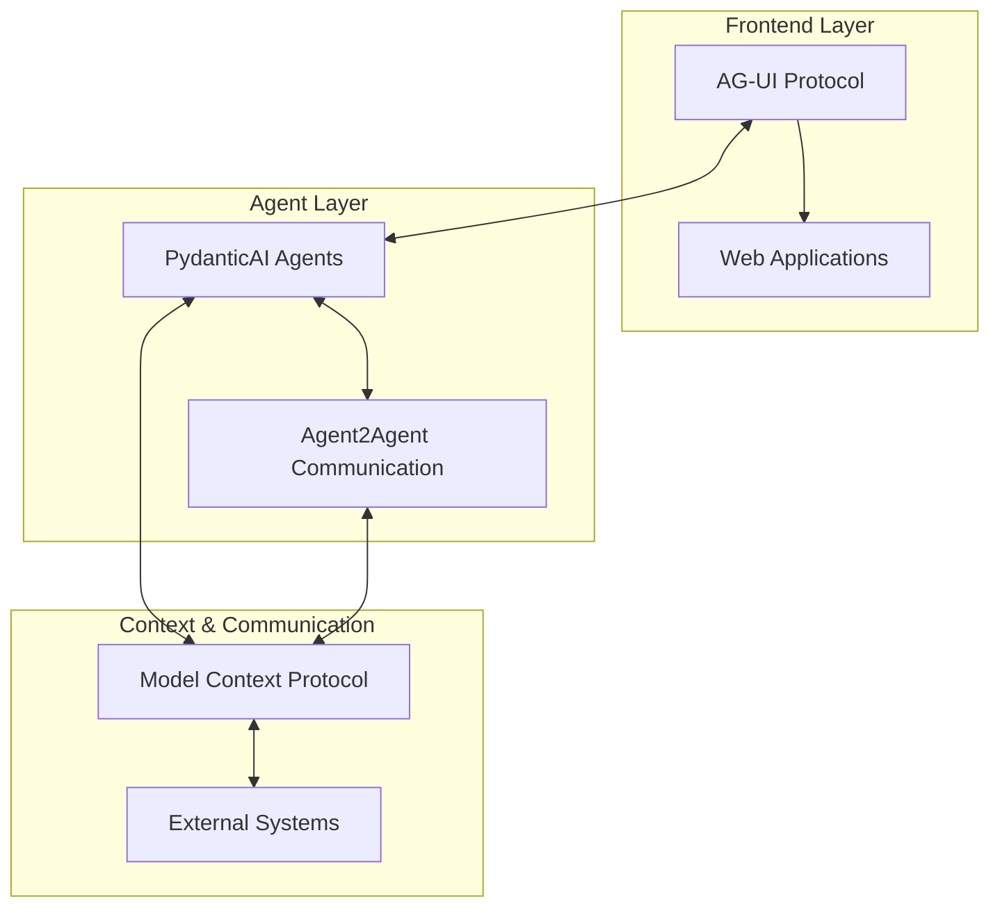

# State-of-the-Art Agentic AI Systems

This repository focuses on building cutting-edge agentic AI systems using the latest frameworks and protocols. We concentrate on four key technologies that represent the current state-of-the-art in agent development and interaction.

## 🎯 Core Frameworks

### 1. PydanticAI - GenAI Agent Framework
**Repository**: [pydantic/pydantic-ai](https://github.com/pydantic/pydantic-ai)  
**⭐ Stars**: 12,802 | **🍴 Forks**: 1,285 | **Language**: Python

PydanticAI is a comprehensive GenAI agent framework built by the Pydantic team, leveraging the power of Pydantic's type safety and validation capabilities for AI agent development.

**Key Features**:
- Type-safe agent development using Pydantic models
- Built-in validation and serialization for agent interactions
- Seamless integration with LLMs and external APIs
- Structured data handling for agent inputs/outputs
- Production-ready with robust error handling

**Use Cases**:
- Building reliable, type-safe AI agents
- Creating structured agent workflows
- Developing production-grade AI applications
- Ensuring data consistency in agent interactions

---

### 2. Model Context Protocol (MCP) - Python SDK
**Repository**: [modelcontextprotocol/python-sdk](https://github.com/modelcontextprotocol/python-sdk)  
**⭐ Stars**: 19,066 | **🍴 Forks**: 2,558 | **Language**: Python

The official Python SDK for Model Context Protocol, enabling seamless communication between AI models and external systems through a standardized protocol.

**Key Features**:
- Standardized protocol for model-context communication
- Server and client implementations
- Extensible architecture for custom integrations
- Real-time context sharing and updates
- Multi-model support and orchestration

**Use Cases**:
- Connecting AI models to external data sources
- Building context-aware AI applications
- Creating distributed AI systems
- Implementing real-time model collaboration

---

### 3. Agent2Agent (A2A) Protocol - Python SDK
**Repository**: [a2aproject/a2a-python](https://github.com/a2aproject/a2a-python)  
**⭐ Stars**: 1,182 | **🍴 Forks**: 244 | **Language**: Python

Official Python SDK for the Agent2Agent (A2A) Protocol, enabling direct communication and collaboration between AI agents.

**Key Features**:
- Direct agent-to-agent communication protocol
- Decentralized agent networks
- Message passing and coordination mechanisms
- Protocol-agnostic agent interactions
- Scalable multi-agent system support

**Use Cases**:
- Building multi-agent systems
- Creating agent collaboration networks
- Implementing distributed AI workflows
- Developing agent-to-agent communication patterns

---

### 4. AG-UI Protocol - Agent-User Interaction
**Repository**: [ag-ui-protocol/ag-ui](https://github.com/ag-ui-protocol/ag-ui)  
**⭐ Stars**: 8,350 | **🍴 Forks**: 752 | **Language**: TypeScript

AG-UI is the Agent-User Interaction Protocol that brings agents into frontend applications, enabling rich user interfaces for agent interactions.

**Key Features**:
- Standardized agent-UI interaction protocol
- Frontend framework integrations
- Real-time agent communication with UIs
- Rich interaction patterns and components
- Cross-platform compatibility

**Use Cases**:
- Building agent-powered web applications
- Creating interactive agent interfaces
- Developing conversational UIs for agents
- Implementing agent workflow visualizations

## 🏗️ Architecture Overview



## 🚀 Getting Started

### Prerequisites
- Python 3.8+
- Node.js (for AG-UI components)
- Basic understanding of AI/ML concepts

### Installation

#### PydanticAI
```bash
pip install pydantic-ai
```

#### MCP Python SDK
```bash
pip install mcp
```

#### A2A Python SDK
```bash
pip install a2a-python
```

#### AG-UI Protocol
```bash
npm install @ag-ui-protocol/core
```

## 📊 Framework Comparison

| Framework | Primary Focus | Language | Maturity | Use Case |
|-----------|---------------|----------|----------|----------|
| PydanticAI | Agent Development | Python | Stable | Type-safe agents |
| MCP | Model-Context Communication | Python | Active | Context management |
| A2A | Agent-to-Agent Communication | Python | Growing | Multi-agent systems |
| AG-UI | Agent-User Interfaces | TypeScript | Active | Frontend integration |

## 🔧 Integration Patterns

### 1. Full Stack Agent Application
```
AG-UI (Frontend) → PydanticAI (Agent Logic) → MCP (Context) → External APIs
```

### 2. Multi-Agent System
```
PydanticAI Agent A ←→ A2A Protocol ←→ PydanticAI Agent B
                ↓                        ↓
            MCP Context ←---------------→ MCP Context
```

### 3. Collaborative Agent Network
```
Multiple PydanticAI Agents ←→ A2A Network ←→ Shared MCP Context ←→ AG-UI Dashboard
```

## 📚 Learning Resources

### Documentation
- [PydanticAI Documentation](https://github.com/pydantic/pydantic-ai)
- [MCP Specification](https://github.com/modelcontextprotocol/python-sdk)
- [A2A Protocol Guide](https://github.com/a2aproject/a2a-python)
- [AG-UI Protocol Docs](https://github.com/ag-ui-protocol/ag-ui)

### Community
- Join the discussions in each repository's Issues and Discussions
- Follow the latest developments and releases
- Contribute to the growing ecosystem

## 🎯 Roadmap

### Phase 1: Foundation
- [ ] Set up development environment
- [ ] Create basic examples for each framework
- [ ] Establish integration patterns

### Phase 2: Integration
- [ ] Build cross-framework examples
- [ ] Develop best practices documentation
- [ ] Create reusable components

### Phase 3: Advanced
- [ ] Production deployment patterns
- [ ] Performance optimization
- [ ] Advanced multi-agent scenarios

## 🤝 Contributing

This repository aims to be a comprehensive resource for state-of-the-art agentic AI development. Contributions are welcome in the form of:

- Example implementations
- Integration patterns
- Documentation improvements
- Best practices
- Performance benchmarks

---

*Last updated: October 7, 2025*  
*Repository: H-Gelender/Agent_State_of_the_art_test*